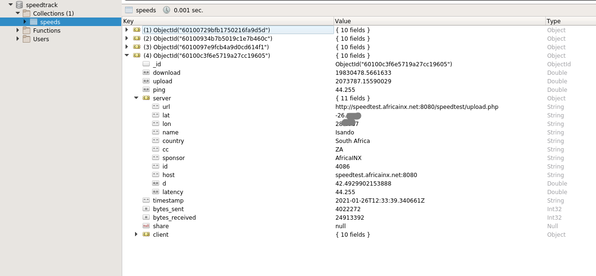

# SpeedTrack CLI

This is a simple command-line interface script that regularly calls the `speedtrack-cli` binary to check for internet-line speeds.

The data is stored in a `MongoDB` instance and is displayed via the [SpeedTrack Full Stack](https://github.com/gmurambadoro/speedtrack-full-stack) client.

## Why am I building this?

The aim is to learn how to develop applications using the [MERN Stack](https://www.mongodb.com/mern-stack) and keep up with the times.

## Installation

1. Create a `.env` file in the current directory by copying from the example `.env.example` file.
2. Modify the following variables accordingly:

    - `MONGO_HOST` e.g. *localhost*
    - `MONGO_PORT` e.g. *27017*
    - `MONGO_DATABASE` e.g. *speedtrack*

3. Install dependencies by running the following:
   
```
$ pip install -r requirements.txt
```

4. Set up a cron job that runs every 5 minutes and downloads bandwidth speeds using the underlying `speedtest-cli` binary
   
```
$ crontab -e
# speedtrack-cli
*/5 * * * * /path/to/speedtrack-cli/cron.sh  >> /var/log/speedtrack-cli.log
```

The result will be that every *5 minutes* the script will download new connection speeds and save to the mongodb instance.

## Screenshot


